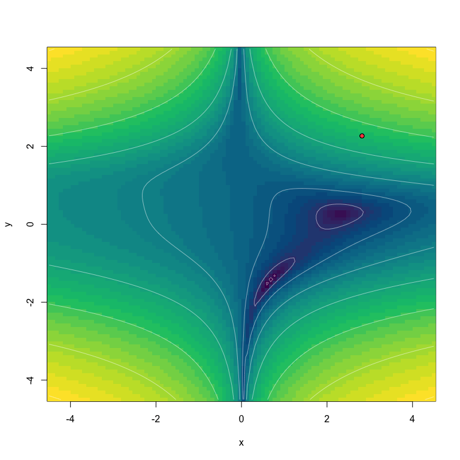

<!-- README.md is generated from README.Rmd. Please edit that file -->

# torchoptx

<!-- badges: start -->
<!-- badges: end -->

torchoptx provides drop-in replacements for torch optimizers using their
C++ implementation directly. Binding directly to the LibTorch
implementation has the performance benefit, as all optimization
computations are done in C++.

Here’s a small example using `optim_sgd` from `torchoptx`.

``` r
torchopt::test_optim(
    optim = torchoptx::optim_sgd,
    test_fn = "beale",
    opt_hparams = list(lr = 0.1),
    steps = 500,
    plot_each_step = TRUE
)
```



And for `optim_adam`:

``` r
torchopt::test_optim(
    optim = torchoptx::optim_adam,
    test_fn = "beale",
    opt_hparams = list(lr = 0.1),
    steps = 500,
    plot_each_step = TRUE
)
```


